# WebRTC Real-time Object Detection System

A production-ready system for real-time multi-object detection on live video streams from mobile phones via WebRTC. Features dual-mode inference (client-side WASM or server-side processing), advanced performance metrics, smart frame queue management with backpressure handling, and automatic ngrok tunneling with QR code generation.

## 🎥 Demo Video

**[1-minute Loom Demo](https://www.loom.com/share/fdaaac33b68b4500beb41001ed27a4f3?sid=71473479-5561-4519-866d-cbb494cf72f3)** - Shows live phone → browser detection with comprehensive metrics

🚀 Quick Start
Prerequisites
Before you begin, please ensure you have the following software installed and running on your local machine:

Git: For cloning the repository.

Docker & Docker Compose: For building and running the application in a container.

Docker Engine: Make sure the Docker daemon is running before you proceed. You can check this by opening Docker Desktop or running docker --version in your terminal.


One-Command Setup use gitbash:
Once the prerequisites are met, you can get the project running with these commands:
```bash
# 1. Clone the repository
git clone https://github.com/sagarrajak245/Real-time-WebRTC-VLM-Multi-Object-Detection.git

# 2. Navigate into the project directory
cd Real-time-WebRTC-VLM-Multi-Object-Detection
cd webrtc-detection

#3 .# Create .env file with your ngrok token
echo "NGROK_AUTHTOKEN=your_actual_token_here" > .env

# 4. Make the start script executable
chmod +x start.sh
# 5. run script
./start.sh
```

### If u got this error means your Docker engine is not Running Run it and error will be fixed:
```bash
-----------------------------------------------------
error during connect: Get "http://%2F%2F.%2Fpipe%2FdockerDesktopLinuxEngine/v1.47/containers/json?all=1&filters=%7B%22label%22%3A%7B%22com.docker.compose.config-hash%22%3Atrue%2C%22com.docker.compose.oneoff%3DFalse%22%3Atrue%2C%22com.docker.compose.project%3Dwebrtc-detection%22%3Atrue%2C%22com.docker.compose.service%3Dwebrtc-detection-app%22%3Atrue%7D%7D": open //./pipe/dockerDesktopLinuxEngine: The system cannot find the file specified.
error during connect: Get "http://%2F%2F.%2Fpipe%2FdockerDesktopLinuxEngine/v1.47/containers/json?all=1&filters=%7B%22label%22%3A%7B%22com.docker.compose.config-hash%22%3Atrue%2C%22com.docker.compose.oneoff%3DFalse%22%3Atrue%2C%22com.docker.compose.project%3Dwebrtc-detection%22%3Atrue%2C%22com.docker.compose.service%3Dwebrtc-detection-app%22%3Atrue%7D%7D": open //./pipe/dockerDesktopLinuxEngine: The system cannot find the file specified.

```


The system automatically:
- ✅ Builds and starts Docker containers
- ✅ It gives u localhost 3000 port URL to run Dispaly of server in browser ui
- ✅ Also u can open ur phone url in local pc itself to test detection 
- ✅ Exposes public URL via ngrok only currently fails when tries to expose ngrok tunnel inside container
- ✅ Generates public URL and code in terminal AND browser when ngrok is installed locally .
- ✅ Else Displays simple url for  *browser:*  (http://localhost:3000)   For *Phone:*(http://localhost:3000/phone) u can open them both on different tab
- ✅ Displays connection instructions

Open `http://localhost:3000` on your laptop, scan the QR code on terminal with your phone, or use public url generated bt nggrok and start detecting objects in real-time.

## 📦 Model Setup if 

This project requires YOLO models for object detection. If you don't have the models locally, you can easily download them using our automated script.

### 🚀 Quick Model Download

We provide a bash script that automatically downloads and sets up both YOLOv5n and YOLOv8n models in the correct directories.

#### Prerequisites
- `curl` (usually pre-installed on most systems)
- Internet connection
- Bash shell (Linux/macOS/WSL/Git Bash)

#### Download Steps

1. **Make the script executable:**
   ```bash
   chmod +x download_models.sh
   ```

2. **Run the download script:**
   ```bash
   ./download_models.sh
   ```

3. **Wait for completion** - The script will:
   - 📁 Create `public/models/` and `server/models/` directories
   - ⬇️ Download YOLOv5n model (~6MB)
   - ⬇️ Download YOLOv8n model (~6MB)
   - 📋 Copy models to both required locations
   - ✅ Verify successful downloads


### 📁 Expected File Structure
After running the script, you should have:
```
webrtc-detection/
├── public/
│   └── models/
│       ├── yolov5n.onnx
│       └── yolov8n.onnx
├── server/
│   └── models/
│       ├── yolov5n.onnx
│       └── yolov8n.onnx
└── download_models.sh
```

### 🔧 Troubleshooting

**If download fails:**
1. Check your internet connection
2. Ensure you have `curl` installed: `curl --version`
3. Try running the script again (sometimes Google Drive has temporary issues)
4. If still failing, download manually:
   - [YOLOv5n Model](https://drive.google.com/uc?export=download&id=1L34kjXyXw-ARzKfsk6p-g75Zd8x-VUGE)
   - [YOLOv8n Model](https://drive.google.com/uc?export=download&id=1ieW8oEUXXrTG2VhMORXqiP6qSLtMmix8)

**Manual Setup (if script fails):**
1. Download both model files from the links above
2. Create directories: `mkdir -p public/models server/models`
3. Place the downloaded `.onnx` files in both directories
4. Rename files to `yolov5n.onnx` and `yolov8n.onnx`

### Available Start Modes
```bash
./start.sh wasm      # Client-side inference (default)
./start.sh server    # Server-side inference
```

### Docker Compose (Recommended)
```bash
docker-compose up --build
```


### Local Node.js (Alternative Method)

For developers who prefer to run the application directly on their local machine without Docker, you can use `npm` scripts. This method is best for quick development and testing.

**Prerequisites:**

  * Node.js (v20.0.0 or higher) installed on your machine.

**1. Install Dependencies:**
First, install all required packages from your project's root directory.

```bash
npm install 
```

**2. Run the Application:**
You can start the server using one of the following commands.

  * **Default Mode (WASM):**

    ```bash
    npm run start
    ```

For windows powershell:
    ```poweshell
    set MODE=server&& npm run start
    ```

  * **Server Mode:**
    You need to set the `MODE` environment variable before running the start script.

    ```bash
    MODE=server npm run start
    ```
    For windows powershell:
    ```poweshell
    set MODE=server&& npm run start
    ```

  * **Development Mode (with auto-restarting):**
    For active development, use the `dev` script which uses `nodemon` to automatically restart the server when you save a file.

    ```bash
    # Starts in default (WASM) mode
    npm run dev

    # Starts in server mode
    MODE=server npm run dev
    ```

 ### Once you started server via ./start.sh output will be like this:


### IF ngrok is installed and authtoken is in .env file then  Teminal QR and Public url be like this: 


### wasm mode browser UI:


### wasm mode metrics:


### server mode metrics:


### Phone browser UI:


### Report generation ui:


# Ngrok Setup Guide

## What is Ngrok?

Ngrok is a secure tunneling service that exposes your local development server to the internet through a public URL. This is useful for:
- Testing webhooks locally
- Sharing your local development with others
- Testing mobile apps against local APIs
- Debugging third-party integrations

## Installation

### Method 1: Download Binary (Recommended)

1. **Sign up for a free ngrok account**
   - Visit [ngrok.com](https://ngrok.com) and create an account
   - Get your authtoken from the dashboard

2. **Download ngrok**
   ```bash
   # For macOS (using Homebrew)
   brew install ngrok/ngrok/ngrok

   # For Windows (using Chocolatey)
   choco install ngrok

   # For Linux (manual download)
   wget https://bin.equinox.io/c/bNyj1mQVY4c/ngrok-v3-stable-linux-amd64.tgz
   tar xvzf ngrok-v3-stable-linux-amd64.tgz
   sudo mv ngrok /usr/local/bin
   ```

3. **Authenticate ngrok**
   ```bash
   ngrok config add-authtoken YOUR_AUTHTOKEN_HERE
   ```

### Method 2: NPM Package (For Node.js projects)

```bash
# Install globally
npm install -g ngrok

# Or install as dev dependency
npm install --save-dev ngrok
```

## Basic Usage

### Command Line Usage

1. **Start your local development server first**
   ```bash
   # Example: Start your app on port 3000
   npm start
   # or
   python manage.py runserver 8000
   # or
   php -S localhost:8080
   ```

2. **Expose your local server**
   ```bash
   # Expose HTTP server on port 3000
   ngrok http 3000

   # Expose HTTPS server
   ngrok http https://localhost:3000

   # Expose with custom subdomain (requires paid plan)
   ngrok http 3000 --subdomain=myapp

   # Expose with basic auth
   ngrok http 3000 --basic-auth="username:password"
   ```

3. **Access your tunnel**
   - Ngrok will display URLs like:
     - `https://abc123.ngrok.io` (HTTPS)
     - `http://abc123.ngrok.io` (HTTP)
   - Use these URLs to access your local application from anywhere


## Configuration File

Create `~/.ngrok2/ngrok.yml` for persistent configuration:

```yaml
version: "2"
authtoken: YOUR_AUTHTOKEN_HERE
region: us

tunnels:
  web:
    addr: 3000
    proto: http
    subdomain: myapp
  
  api:
    addr: 8000
    proto: http
    subdomain: myapp-api
```

Start named tunnels:
```bash
ngrok start web api
```

## Common Use Cases

### Webhook Testing

```bash
# Start your webhook endpoint locally (e.g., port 3000)
npm start

# Expose it via ngrok
ngrok http 3000

# Use the ngrok URL in your webhook configuration
# Example: https://abc123.ngrok.io/webhooks/stripe
```

### Mobile App Development

```bash
# Start your API server
npm run dev

# Expose it
ngrok http 3000

# Use the ngrok URL in your mobile app configuration
# Example: https://abc123.ngrok.io/api
```

## Environment Variables

Create a `.env` file to manage your ngrok configuration:

```bash
NGROK_AUTHTOKEN=your_authtoken_here
NGROK_SUBDOMAIN=myapp
NGROK_REGION=us
```

## Useful Commands

```bash
# Check ngrok version
ngrok version

# List active tunnels
ngrok tunnel list

# Inspect HTTP traffic
# Visit http://localhost:4040 in your browser

# Start with specific region
ngrok http 3000 --region=eu

# Bind to specific host
ngrok http mysite.dev:80

# TCP tunnel (for non-HTTP services)
ngrok tcp 22
```

## Security Considerations

- **Free accounts** get random URLs that change each restart
- **Never expose sensitive data** through ngrok tunnels
- **Use basic auth** for additional security when needed
- **Monitor traffic** through the web interface at `http://localhost:4040`
- **Use HTTPS URLs** when possible for encrypted traffic

## Troubleshooting

### Common Issues

1. **"tunnel not found" error**
   - Make sure your local server is running on the specified port

2. **Authentication failed**
   - Verify your authtoken: `ngrok config check`
   - Re-add your authtoken: `ngrok config add-authtoken YOUR_TOKEN`

3. **Connection refused**
   - Check if the port is correct and available
   - Ensure no firewall is blocking the connection

4. **Tunnel limit exceeded**
   - Free accounts have a limit of 1 tunnel at a time
   - Upgrade to a paid plan for more tunnels

### Getting Help

- Check ngrok status: `ngrok diagnose`
- View logs: Check `~/.ngrok2/ngrok.log`
- Documentation: [ngrok.com/docs](https://ngrok.com/docs)

## Integration with Your Project

Add these scripts to your `package.json`:

```json
{
  "scripts": {
    "dev": "npm start",
    "tunnel": "ngrok http 3000",
    "dev:tunnel": "concurrently \"npm start\" \"ngrok http 3000\""
  }
}
```

Now you can run:
```bash
npm run dev:tunnel
```

This will start both your development server and ngrok tunnel simultaneously.

---

**Note**: Replace `3000` with your actual port number and `YOUR_AUTHTOKEN_HERE` with your actual ngrok authtoken.

## 🏗️ System Architecture

### Dual-Mode Processing Architecture

```mermaid
graph TB
    Phone[📱 Phone Camera] --> WebRTC[WebRTC Stream]
    WebRTC --> Browser[🖥️ Browser Display]
    
    subgraph "Processing Modes"
        WASM[🔧 WASM Mode<br/>YOLOv5n Client-side]
        Server[⚡ Server Mode<br/>YOLOv8n Server-side]
    end
    
    Browser --> WASM
    Browser --> Server
    
    WASM --> Overlay[🎯 Detection Overlays]
    Server --> Overlay
```



### **WASM Mode** (Default - Client-side)
- **Model**: YOLOv5n quantized ONNX (5MB, 320×320 output)
- **Runtime**: ONNX Runtime Web with WASM backend
- **Processing**: Browser-side inference using Web Workers
- **Advantages**: Privacy-preserving, reduced server load, lower network latency
- **Trade-offs**: Higher client resource usage, device-dependent performance

### **Server Mode** (Server-side)
- **Model**: YOLOv8n ONNX (6MB, 320×320 output)
- **Runtime**: ONNX Runtime Node.js
- **Processing**: Centralized inference with smart queue management
- **Advantages**: Consistent performance, centralized optimization
- **Trade-offs**: Higher bandwidth usage, server resource requirements

### Key Components

- **WebRTC Pipeline**: Phone camera → WebRTC → Browser display with overlays
- **Smart Frame Processor**: Advanced queue management with backpressure (server mode)
- **Bandwidth Monitor**: Real-time WebRTC connection quality tracking
- **ngrok Integration**: Automatic public URL generation with QR codes
- **Benchmark Suite**: Comprehensive performance analysis with 30+ metrics

## 📊 Performance Metrics

### WASM Mode (Client-side YOLOv5n)
```json
{
  "mode": "wasm",
  "processed_fps": 18.7,
  "e2e_latency": {
    "median_ms": 83,
    "p95_ms": 193,
    "mean_ms": 105.4
  },
  "network_stats": {
    "downlink_kbps": {
      "avg": 1964.4,
      "peak": 3732.9,
      "utilization": "85.2%"
    }
  },
  "detection_rate": 1.0,
  "bottleneck_detection": "Client Processing",
  "resource_usage": {
    "client_cpu": "65%",
    "memory_mb": 180
  }
}
```

### Server Mode (Server-side YOLOv8n)
```json
{
  "mode": "server",
  "processed_fps": 7.5,
  "e2e_latency": {
    "median_ms": 74,
    "p95_ms": 109,
    "mean_ms": 88.2
  },
  "latency_breakdown": {
    "network": { "median_ms": 1, "percentage": 1.4 },
    "server_processing": { "median_ms": 72, "percentage": 97.3 },
    "queue_wait": { "median_ms": 1, "percentage": 1.3 }
  },
  "queue_metrics": {
    "utilization": "10.00%",
    "dropped_frames": 0,
    "max_queue_size": 10
  },
  "network_bidirectional": {
    "uplink_kbps": 2140,
    "downlink_kbps": 890
  }
}
```

### Performance Comparison Summary

| Metric | WASM Mode | Server Mode | Analysis |
|--------|-----------|-------------|----------|
| **Processing FPS** | 18.7 | 7.5 | WASM achieves 2.5× higher throughput |
| **Median Latency** | 83ms | 74ms | Server mode has 11% lower latency |
| **P95 Latency** | 193ms | 109ms | Server mode has 44% better P95 performance |
| **Detection Rate** | 100% | 100% | Both modes achieve perfect detection coverage |
| **Network Usage** | 1.96 Mbps | Variable | WASM primarily downlink, server bidirectional |
| **Resource Location** | Client | Server | Different computational distribution strategies |

## 📱 Phone Connection Instructions

### Method 1: Automatic QR Code (Recommended)

The system generates QR codes in **both locations**:

1. **Terminal QR Code**: Displayed when running `./start.sh`
```bash
./start.sh wasm
# ✅ Application started. Waiting for ngrok QR code...
# QRCode: [ASCII QR CODE DISPLAYED HERE]
# 📱 Scan the QR code above with your phone to connect.
```

2. **Browser QR Code**: Available at `http://localhost:3000`
   - Displays both local and ngrok URLs
   - Interactive QR codes for easy scanning
   - Connection status indicators

### Method 2: ngrok Public URL (Automatic)

The system automatically:
- Reads `NGROK_AUTHTOKEN` from `.env` file
- Creates public tunnel via ngrok
- Generates accessible URLs for any network
- Displays connection URLs in terminal and browser

### Method 3: Manual IP Connection
```bash
# Find your local IP
ip addr show | grep inet

# On phone, navigate to:
# http://YOUR_LOCAL_IP:3000/phone
```

### Supported Browsers
- **Android**: Chrome (recommended), Firefox
- **iOS**: Safari (latest), Chrome  
- **Requirements**: WebRTC support, camera access

## 🛠️ Custom Model Training (320×320 Output)

### YOLOv5 Model Customization
```python
# Training YOLOv5n with 320x320 output instead of default 640x640
from yolov5 import train

train.run(
    imgsz=320,          # Input image size
    data='coco.yaml',   # Dataset configuration
    weights='yolov5n.pt',  # Pre-trained weights
    epochs=100,
    batch_size=16,
    project='runs/train',
    name='yolov5n_320'
)

# Export to ONNX format
python export.py --weights runs/train/yolov5n_320/weights/best.pt --include onnx --imgsz 320
```

### YOLOv8 Model Customization
```python
from ultralytics import YOLO

# Load and train YOLOv8n with custom input size
model = YOLO('yolov8n.pt')
model.train(
    data='coco.yaml',
    epochs=100,
    imgsz=320,          # 320x320 input size
    batch=16,
    project='runs/train',
    name='yolov8n_320'
)

# Export to ONNX
model.export(format='onnx', imgsz=320)
```

### Model Integration
Place your trained models in:
```
models/
├── yolov5n_320.onnx    # WASM mode
├── yolov8n_320.onnx    # Server mode
└── model_config.json   # Model metadata
```

## 🔧 Benchmarking

### Quick Benchmark
```bash
./bench/run_bench.sh --duration 30 --mode wasm
```

### Advanced Benchmarking
```bash
# Server mode with extended duration
./bench/run_bench.sh --duration 60 --mode server

# Custom configuration
./bench/run_bench.sh --duration 45 --mode wasm
```

### Automated Benchmark Process

The `run_bench.sh` script automatically:
1. ✅ Builds and starts Docker containers
2. ✅ Waits for service initialization (15 seconds)
3. ✅ Triggers benchmark via API call
4. ✅ Collects metrics during specified duration
5. ✅ Saves results to `bench/metrics.json`
6. ✅ Cleanly stops all services

### Benchmark Output Structure
```json
{
  "benchmark_config": {
    "duration_seconds": 30,
    "mode": "wasm",
    "timestamp": "2024-01-15T10:30:00Z"
  },
  "performance_metrics": {
    "end_to_end_latency": {
      "median_ms": 83,
      "p95_ms": 193,
      "mean_ms": 105.4,
      "samples": 560
    },
    "processing_fps": 18.7,
    "detection_rate": 1.0,
    "frame_processing_stats": {
      "total_frames": 560,
      "successful_detections": 560,
      "dropped_frames": 0
    }
  }
}
```

## 🎯 Low-Resource Mode Features

### Adaptive Processing Optimizations

**Input Resolution**: 320×320 pixels (75% reduction from default 640×640)
- Memory impact: 307KB per frame (vs 2.4MB for 640×640)
- Processing reduction: 75% computational load decrease
- Quality retention: Optimized for mobile object detection

**Frame Rate Management**: Adaptive 8 FPS capture rate
```javascript
const CAPTURE_FPS = 8; // Optimized for real-time performance
const frameInterval = setInterval(captureFrame, 1000 / CAPTURE_FPS);
```

**Memory Management**: Automatic cleanup and garbage collection
- Triggers GC when memory usage exceeds 85%
- Frame buffer limits: Maximum 100 frames in history
- Canvas optimization: Reuses contexts to prevent leaks

### Smart Queue Management (Server Mode)

```javascript
class FrameProcessor {
  constructor(maxQueueSize = 10, timeoutMs = 5000) {
    this.maxQueueSize = maxQueueSize;
    this.processingTimeoutMs = timeoutMs;
    this.metrics = { queueDropped: 0, processed: 0 };
  }

  enqueueFrame(frameData, inferenceFunction, socket) {
    // Drop-oldest backpressure policy
    if (this.frameQueue.length >= this.maxQueueSize) {
      const droppedFrame = this.frameQueue.shift();
      this.metrics.queueDropped++;
    }
    
    // Always process latest frame for real-time performance
    this.frameQueue.push({ frameData, inferenceFunction, socket, timestamp: Date.now() });
    this.processNext();
  }
}
```

### Resource Requirements

**Development Environment**:
- CPU: Intel i5 dual-core minimum, quad-core recommended
- Memory: 4GB minimum, 8GB recommended  
- Network: 5 Mbps symmetric for optimal performance
- Browser: Chrome 90+, Safari 14+, Firefox 88+

**Production Container Limits**:
```yaml
resources:
  limits:
    cpu: "2.0"
    memory: "4Gi"
  requests:
    cpu: "1.0" 
    memory: "2Gi"
```

**Mobile Device Requirements**:
- Android: Chrome 80+, 2GB RAM, ARMv7/ARM64
- iOS: Safari 13+, iPhone 7/iPad 2018 or newer
- Network: 2 Mbps uplink for 320p video streaming

## ⚙️ Configuration Options

### Environment Variables
```bash
MODE=wasm|server          # Processing mode
PORT=3000                 # Server port
INPUT_SIZE=320            # Model input resolution  
MAX_QUEUE_SIZE=10         # Frame processor queue size
PROCESSING_TIMEOUT=5000   # Frame timeout (ms)
NGROK_AUTHTOKEN=your_token # ngrok authentication
```
### Docker File:
``` yaml
# Use an official Node.js runtime as a parent image (version 20 as required by package.json)
FROM node:20-slim

# Install necessary tools: wget and unzip for ngrok
RUN apt-get update && apt-get install -y wget unzip && rm -rf /var/lib/apt/lists/*

# Set the working directory in the container
WORKDIR /usr/src/app

# Manually install the correct ngrok binary for the container's architecture
RUN ARCH=$(uname -m) && \
    case ${ARCH} in \
        x86_64) NGROK_ARCH="amd64" ;; \
        aarch64) NGROK_ARCH="arm64" ;; \
        *) echo "Unsupported architecture: ${ARCH}"; exit 1 ;; \
    esac && \
    wget -q https://bin.equinox.io/c/bNyj1mQVY4c/ngrok-v3-stable-linux-${NGROK_ARCH}.zip && \
    unzip ngrok-v3-stable-linux-${NGROK_ARCH}.zip && \
    mv ngrok /usr/local/bin/ngrok && \
    rm ngrok-v3-stable-linux-${NGROK_ARCH}.zip

# Copy package.json and package-lock.json to leverage Docker cache
COPY package*.json ./

# Install app dependencies, including optional ones for server mode
RUN npm install --include=optional

# Bundle app source
COPY . .

# Your app binds to port 3000, so expose it
EXPOSE 3000

# Define the command to run your app
CMD [ "node", "server/index.js" ]

```
### Docker Environment Configuration
```yaml
# docker-compose.yml
services:
  webrtc-detection-app:
    build: .
    container_name: webrtc_detection_service
    ports:
      - "3000:3000"
    volumes:
      - ./server:/usr/src/app/server
      - ./client:/usr/src/app/client
      - ./public:/usr/src/app/public
      - ./bench:/usr/src/app/bench
    environment:
      - MODE=wasm
      - NGROK_AUTHTOKEN=${NGROK_AUTHTOKEN}  # Reads from .env
    command: npm run dev
```

### Runtime Mode Switching
```bash
# Switch to server mode
./start.sh server

# Enable development mode
npm run dev

# Custom port
PORT=8080 ./start.sh
```

## 🔍 Advanced Features

### Real-time Metrics Dashboard

The system provides comprehensive monitoring with 30+ metrics:

**Network Metrics**:
- Live bandwidth utilization (uplink/downlink)
- WebRTC connection quality (RTT, jitter, packet loss)
- Video resolution and framerate tracking

**Processing Metrics**:
- End-to-end latency distribution (median, P95, mean)
- Frame processing queue status and utilization
- Detection rate and accuracy statistics

**Performance Metrics**:
- CPU and memory usage tracking
- Bottleneck identification and analysis
- Resource utilization optimization

### Smart Frame Processing

**Backpressure Handling**: 
- Drops oldest frames when queue is full
- Maintains processing queue under 10% utilization
- Zero frame drops during normal operation

**Timeout Protection**: 
- Prevents processing stalls with 5-second timeout
- Automatic recovery from processing failures
- Graceful degradation under high load

**Adaptive Quality**: 
- Maintains real-time performance under varying loads
- Dynamic resolution adjustment based on performance
- Intelligent frame rate adaptation

### WebRTC Statistics Monitoring

```javascript
class WebRTCStatsMonitor {
  async collectStats() {
    const stats = await this.peerConnection.getStats();
    return {
      bandwidth: this.calculateBandwidth(stats),
      latency: this.measureLatency(stats),
      quality: this.assessConnectionQuality(stats)
    };
  }
}
```

## 📡 API Reference

### Detection Results Format
```javascript
{
  "frame_id": "frame_1640000000123",
  "capture_ts": 1640000000000,
  "recv_ts": 1640000000100,
  "inference_ts": 1640000000120,
  "latency_breakdown": {
    "network_latency_ms": 100,
    "server_latency_ms": 20,
    "queue_wait_ms": 5
  },
  "detections": [
    {
      "label": "person",
      "score": 0.93,
      "bbox": {
        "xmin": 0.12,    // Normalized coordinates [0-1]
        "ymin": 0.08,
        "xmax": 0.34,
        "ymax": 0.67
      }
    }
  ],
  "processing_mode": "server",
  "model_info": {
    "name": "YOLOv8n",
    "input_size": "320x320",
    "inference_time_ms": 18.5
  }
}
```

### REST Endpoints

**System Status**:
- `GET /health` - System health and configuration
- `GET /api/metrics/realtime` - Live performance metrics
- `GET /api/system/info` - System information and capabilities

**Benchmarking**:
- `POST /api/benchmark/start` - Start benchmark run
- `GET /api/benchmark/results` - Retrieve benchmark results
- `POST /api/benchmark/save` - Save results to file
- `DELETE /api/benchmark/clear` - Clear benchmark history

**Configuration**:
- `GET /api/config` - Current system configuration
- `POST /api/config/mode` - Switch processing mode
- `GET /api/models/info` - Model information and capabilities

## 🐳 Docker Configuration

### Production Deployment
```dockerfile
# Dockerfile optimized for production
FROM node:20-slim

WORKDIR /usr/src/app

# Copy package files and install dependencies
COPY package*.json ./
RUN npm install --include=optional --production

# Bundle application source
COPY . .

# Expose application port
EXPOSE 3000

# Health check endpoint
HEALTHCHECK --interval=30s --timeout=10s --start-period=5s --retries=3 \
  CMD curl -f http://localhost:3000/health || exit 1

# Start application
CMD ["node", "server/index.js"]
```

### Development Setup
```yaml
# docker-compose.dev.yml
version: '3.8'
services:
  webrtc-detection-app:
    build: .
    container_name: webrtc_detection_dev
    ports:
      - "3000:3000"
    volumes:
      - ./:/usr/src/app
      - /usr/src/app/node_modules
    environment:
      - NODE_ENV=development
      - MODE=wasm
    command: npm run dev
```
# 🧪 Troubleshooting Guide

This guide covers common issues that may arise during setup and operation of the WebRTC Detection Service.

## 📱 Phone Cannot Connect to PC

**The most common issue** - typically caused by network restrictions that prevent the phone and PC from communicating directly.

**Symptom:** The QR code loads a page on the phone, but the video stream never appears on the PC browser.

### Solution 1: Ensure Same Wi-Fi Network

- Your phone and computer **must be connected to the exact same Wi-Fi network**
- Public or corporate networks (office/university) often have "Client Isolation" security features that block device-to-device communication
- **Home networks work best** for this application

### Solution 2: Verify Ngrok is Working (Docker Users)

The `start.sh` script uses ngrok to create a public URL, which bypasses most network issues.

If ngrok fails, follow these steps:

1. **Create a free account** at [ngrok.com](https://ngrok.com) to get your personal authtoken
2. **Create a `.env` file** in the root project directory
3. **Add your token** to the `.env` file:
   ```env
   NGROK_AUTHTOKEN=YOUR_SECRET_TOKEN_HERE
   ```
4. **Restart the application** with `./start.sh` - the script will automatically use your token

### Solution 3: Manual Ngrok Tunnel (Local Node.js Users)

If running locally with `npm run start` and ngrok fails:

1. **Install ngrok** on your local machine following instructions at [ngrok.com](https://ngrok.com)
2. **Add your authtoken** (one-time setup):
   ```bash
   ngrok config add-authtoken YOUR_SECRET_TOKEN_HERE
   ```
3. **Start your application** in one terminal:
   ```bash
   npm run start
   ```
4. **Start ngrok tunnel** in a second terminal:
   ```bash
   ngrok http 3000
   ```
5. **Use the ngrok URL** (e.g., `https://random-string.ngrok-free.app`) on your phone

---

## 🔥 High CPU Usage or Slow Performance

**Symptom:** Low FPS, high latency, loud fan, and generally unresponsive system.

### Solution 1: Switch to WASM Mode (Recommended)

WASM mode is the **low-resource path** designed for modest hardware - runs AI model directly in browser.

```bash
# Stop current session (Ctrl+C) and restart in WASM mode
./start.sh wasm
```

### Solution 2: Monitor Resource Usage

Use Docker's built-in stats to monitor container resource consumption:

```bash
docker stats webrtc_detection_service
```

---

## 📡 Video Stream is Laggy or Delayed

**Symptom:** Noticeable delay between movement on phone and corresponding action on PC screen.

### Solution 1: Check for Network Bottlenecks

1. **Open WebRTC debugger** in Chrome: navigate to `chrome://webrtc-internals`
2. **Find the active connection** and inspect the graphs
3. **Look for:**
   - High round-trip time (RTT > 200ms) = poor Wi-Fi signal or network congestion
   - Significant packet loss = network issues

### Solution 2: Check for Processing Bottlenecks

1. **Run a benchmark:**
   ```bash
   ./bench/run_bench.sh --mode server
   ```

2. **Analyze results** in `bench/metrics.json` - check `latency_breakdown`:
   - **High `network` latency** = network issue
   - **High `queue_wait`** = server overloaded (reduce client frame rate)
   - **High `server_processing`** = hardware bottleneck

---

## 🎯 Detection Overlays are Misaligned

**Symptom:** Green bounding boxes don't correctly line up with objects in the video stream.

**Cause:** Timestamp synchronization issue - the system relies on `capture_ts` (capture timestamp) to align detection results with correct video frames.

**Solution:** This indicates a bug in application logic where timestamps are either:
- Not being sent correctly from the client
- Not being returned properly with detection results

**Fix:** Ensure all timestamps consistently use milliseconds throughout the application.

---

## 🚨 Emergency Troubleshooting

### Quick Reset
```bash
# Stop everything
docker-compose down

# Clean rebuild
docker-compose up --build -d

# Check logs
docker-compose logs -f webrtc-detection-app
```

### Check Service Health
```bash
curl http://localhost:3000/health
```

### Debug Mode
Enable debug mode in the web interface for detailed diagnostic information.

---

## 💡 Tips for Best Performance

- **Use a home Wi-Fi network** whenever possible
- **Start with WASM mode** for lower resource usage
- **Keep phone and PC close** to Wi-Fi router
- **Close other bandwidth-heavy applications**
- **Use Chrome browser** for best WebRTC support

---

## 🆘 Still Need Help?

If you're still experiencing issues:

1. **Check the console logs** in both browser and terminal
2. **Run the health check** endpoint: `http://localhost:3000/health`
3. **Enable debug mode** in the web interface
4. **Try different network environments** (different Wi-Fi networks)

For additional support, please provide:
- Your operating system and version
- Node.js version (`node --version`)
- Docker version (`docker --version`)
- Network environment (home/office/public)
- Console error messages
**Detection Overlay Misalignment**:
- Verify timestamp synchronization between phone and browser
- Check browser console for WebRTC errors  
- Ensure stable network connection (>2 Mbps uplink)
- Confirm proper lighting conditions

**Poor Detection Quality**:
- Ensure adequate lighting conditions
- Keep objects in frame center for better detection
- Check minimum bandwidth requirements (2 Mbps uplink)
- Verify model is properly loaded and initialized

### Debug Mode
```bash
DEBUG=true ./start.sh
```

Enables comprehensive logging:
- Detailed WebRTC connection diagnostics
- Frame processing pipeline metrics
- Performance profiling and bottleneck analysis
- Network bandwidth and quality monitoring

### Performance Monitoring
```bash
# Check container resource usage
docker stats

# Monitor network interface
ifstat -i wlan0

# WebRTC connection diagnostics
# Navigate to chrome://webrtc-internals
```

## 📈 Model Information

### WASM Mode: YOLOv5n (320×320)
- **Architecture**: YOLOv5 nano optimized for web deployment
- **Model Size**: ~5MB quantized ONNX
- **Input Resolution**: 320×320×3 (optimized from 640×640)
- **Output Classes**: 80 COCO object classes
- **Performance**: ~18.7 FPS on modern devices
- **Optimization**: INT8 quantization for faster inference

### Server Mode: YOLOv8n (320×320)  
- **Architecture**: YOLOv8 nano with enhanced accuracy
- **Model Size**: ~6MB ONNX format
- **Input Resolution**: 320×320×3 (custom trained)
- **Output Classes**: 80 COCO object classes  
- **Performance**: ~7.5 FPS with queue management
- **Features**: Advanced post-processing and NMS

### Model Output Format
Both models output detections in consistent format:
```javascript
// Normalized bounding box coordinates [0-1]
{
  "detections": [
    {
      "class_id": 0,        // COCO class ID
      "label": "person",    // Human-readable label
      "confidence": 0.93,   // Detection confidence [0-1]
      "bbox": {
        "x_center": 0.23,   // Normalized center X
        "y_center": 0.38,   // Normalized center Y  
        "width": 0.22,      // Normalized width
        "height": 0.59      // Normalized height
      }
    }
  ]
}
```

## 🤝 Contributing

### Development Setup
```bash
# Clone repository
git clone <your-repo-url>
cd webrtc-detection

# Install dependencies
npm install --include=optional

# Start development server
npm run dev

# Run test suite
npm test

# Build production bundle
npm run build
```
### project structure:
```
webrtc-detection/
├── bench/
│   └── run_bench.sh
├── client/
│   ├── app.js
│   ├── index.html
│   ├── phone.html
│   ├── wasm-inference.js
│   ├── WebRTCStatsMonitor.js
│   └── logs/
├── model-train/
│   ├── size.py
│   ├── train.py
│   ├── yolov8n-int8.onnx
│   └── yolov8n.onnx
├── node_modules/
├── public/
├── server/
│   ├── models/
│   ├── Frameprocessor.js
│   ├── index.js
│   └── inference.js
├── .env
├── .gitignore
├── docker-compose.yml
├── Dockerfile
├── download-yolov8.sh
├── package-lock.json
├── package.json
├── start.sh
├── TEST-CHECKLIST.md
└── README.md
## 🔒 Security and Privacy

### Data Protection
- **Client-side Processing**: WASM mode keeps video data on device
- **Encrypted Transport**: WebRTC uses DTLS/SRTP encryption
- **No Persistence**: Frames processed in memory, not stored
- **Privacy by Design**: Minimal data collection and processing

### Network Security  
- **ICE/STUN**: Secure NAT traversal without compromising security
- **Origin Validation**: CORS policies prevent unauthorized access
- **Rate Limiting**: Prevents abuse of inference endpoints
- **Token Authentication**: ngrok tunnel protection

### Access Controls
```javascript
// CORS configuration
const corsOptions = {
  origin: ['http://localhost:3000', process.env.NGROK_URL],
  credentials: true,
  optionsSuccessStatus: 200
};
```

## 📊 Monitoring and Observability

### Performance Metrics Collection
The system automatically collects and analyzes:

**Latency Metrics**:
- End-to-end processing latency (median, P95, mean)
- Network round-trip time and jitter
- Queue wait times and processing delays

**Throughput Metrics**:
- Frames processed per second
- Detection success rate
- Network bandwidth utilization

**Resource Metrics**:
- CPU and memory usage patterns
- Queue utilization and backpressure events
- WebRTC connection quality indicators

### Automated Benchmarking
```bash
# 30-second comprehensive benchmark
./bench/run_bench.sh --duration 30 --mode server

# Custom benchmark with specific parameters
DURATION=60 MODE=wasm ./bench/run_bench.sh
```

Results include detailed performance analysis and bottleneck identification.

## 🚧 Known Limitations and Future Improvements

### Current Limitations
1. **Browser Compatibility**: iOS Safari has limited WebRTC feature parity
2. **Network Dependency**: Requires stable 2+ Mbps connection for optimal performance  
3. **Processing Constraints**: WASM mode limited by client device capabilities
4. **Model Scope**: Current models support 80 COCO classes only
5. **Single Stream**: One phone connection per server instance

### Planned Improvements

**Priority 1 - Network Optimization**:
- Adaptive bitrate control based on connection quality
- Dynamic resolution adjustment for bandwidth constraints
- Smart frame rate adaptation for varying network conditions

**Priority 2 - Model Enhancement**:
- Runtime model switching based on device capabilities
- Custom model training pipeline integration
- Support for custom object classes and fine-tuning

**Priority 3 - Scalability**:
- Multi-stream support for simultaneous phone connections
- Load balancing across multiple inference servers  
- Edge caching for model deployment optimization

**Priority 4 - User Experience**:
- Progressive Web App (PWA) support
- Offline mode with local model caching
- Enhanced mobile interface with gesture controls

### Next Development Sprint
**Adaptive Network Management**: Implement intelligent bitrate and frame rate adaptation based on real-time network quality metrics to maintain optimal performance across varying network conditions while preserving detection accuracy.

## 📄 License

MIT License - see LICENSE file for details.

## 🆘 Technical Support

For issues, questions, or contributions:

1. **Check Documentation**: Review this README and troubleshooting section
2. **Search Issues**: Check existing GitHub issues for similar problems
3. **Create Issue**: Submit detailed issue report including:
   - System specifications and browser version
   - Steps to reproduce the problem
   - Console logs and error messages
   - Expected vs actual behavior

### Community Resources
- **GitHub Discussions**: General questions and feature requests
- **Wiki**: Extended documentation and tutorials
- **Examples**: Sample implementations and use cases

---

## ✨ Key Success Metrics

The system demonstrates production-ready performance:

- ✅ **Real-time Performance**: <200ms P95 latency across both modes
- ✅ **High Throughput**: 7.5-18.7 FPS processing rate depending on mode  
- ✅ **Perfect Detection Coverage**: 100% frame detection rate
- ✅ **Resource Efficiency**: <10% queue utilization, zero frame drops
- ✅ **Network Optimization**: Intelligent bandwidth usage (1-4 Mbps)
- ✅ **Automated Deployment**: One-command setup with ngrok integration
- ✅ **Comprehensive Monitoring**: 30+ performance metrics with real-time analysis

**Ready for production deployment with clear scaling and enhancement pathways.** 
